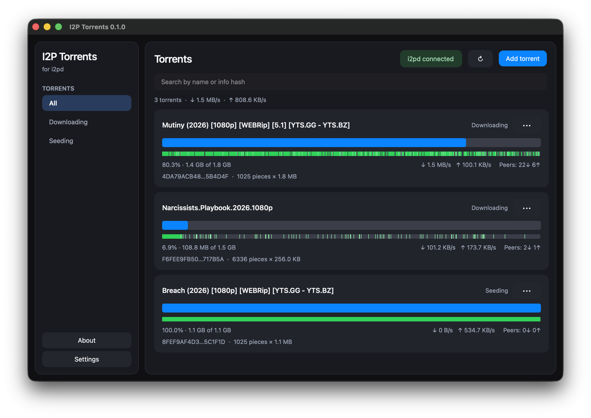
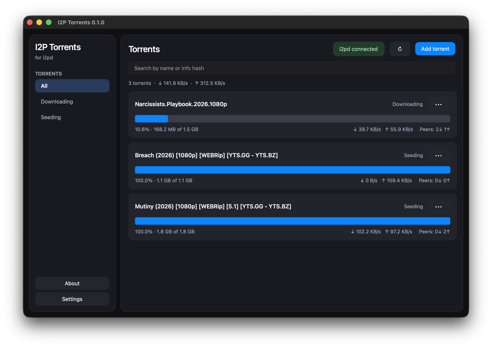

<p align="center">
  
</p>

<h1 align="center">I2P Torrents</h1>

<p align="center">
  Cross-platform desktop GUI for the built-in <a href="https://i2pd.website">i2pd</a> torrent client<br>
  <a href="#english">English</a> · <a href="#русский">Русский</a>
</p>

<p align="center">
  <br>
  
</p>

---

## English

A desktop client for i2pd’s torrent tunnel. The UI follows the look of [I2PChat-ng](https://github.com/MetanoicArmor/I2PChat-ng): light and night themes, cards, a compact sidebar, and native behaviour on Linux, Windows, and macOS.

### Features

- torrent list, progress, piece map, rates, peers, and info hash;
- simple card view in settings (no piece bar or hash);
- copy info hash / magnet and open the download folder;
- add `.torrent` files and magnet links (`xt=urn:btih:…`);
- magnets are resolved via [Postman](http://tracker2.postman.i2p) and the i2pd SOCKS proxy (`127.0.0.1:4447`);
- remove a torrent alone or together with downloaded data;
- search, filters, UI language (English / Русский), and theme in settings;
- automatic refresh and connection diagnostics;
- fallback without RPC: copy the `.torrent` into `torrentsdir`;
- persist RPC address, folder, and theme.

### i2pd setup

Add to `tunnels.conf`:

```ini
[MyTorrents]
type=torrents
trackers=http://tracker2.postman.i2p/announce.php
torrentsdir=/home/i2pd/torrents
rpcport=9191
rpcpath=mytorrents
```

Do not change the tracker. RPC needs an i2pd build with Boost 1.81 or newer. In the GUI use the usual address:

```text
http://127.0.0.1:9191/mytorrents
```

The app turns that into the real endpoint `/mytorrents/rpc/`.
i2pd RPC has no authentication or TLS, so the GUI only allows loopback
(`localhost`, `127.0.0.0/8`, `::1`).

### Run from source

Python 3.10+ is required.

```bash
python3 -m venv .venv
source .venv/bin/activate       # Windows: .venv\Scripts\activate
pip install -e .
i2ptorrents-gui
```

### Build

The icon source is `image.png`. The scripts produce `icon.png`, a Windows `.ico`, and (on macOS) `.icns`, then pack a PyInstaller onedir.

From the repo root (do not wrap the path in extra quotes):

```bash
./build-macos.sh      # macOS
./build-linux.sh      # Linux
i2ptorrents-build     # same, after `pip install -e .`
```

**macOS**

```bash
./build-macos.sh
```

Result: `dist/I2PTorrents.app` and `I2PTorrents-macOS-<arch>-v<version>.zip`.

**Linux**

```bash
./build-linux.sh
```

Result: `dist/I2PTorrents/`, `I2PTorrents-linux-<arch>-v<version>.zip`, and an AppImage in `dist/` when `appimagetool` is available.

**Windows** (PowerShell)

```powershell
.\build-windows.ps1
```

Result: `dist\I2PTorrents\I2PTorrents.exe` and `I2PTorrents-windows-x64-v<version>.zip`.

Python 3.10+, Pillow, and PyInstaller are required (the scripts install them into `.venv`). The release version comes from the `VERSION` file.

### i2pd RPC limits

Current i2pd only exposes `torrent-add`, `torrent-get`, and `torrent-remove`. Pause, resume, tracker edits, and speed limits are not available on the daemon yet. Magnets are not accepted over RPC: the GUI downloads a `.torrent` from Postman through the i2pd SOCKS proxy (`127.0.0.1:4447`) and sends it as `metainfo`.

### License

[BSD 3-Clause](LICENSE). Author: [Vade](AUTHORS).

---

## Русский

Кроссплатформенный настольный клиент для встроенного torrent-клиента i2pd. Интерфейс выполнен в визуальном стиле [I2PChat-ng](https://github.com/MetanoicArmor/I2PChat-ng): светлая и ночная темы, карточки, компактная боковая панель и нативное поведение на Linux, Windows и macOS.

### Возможности

- список торрентов, прогресс, карта кусков, скорости, пиры и info hash;
- упрощённый вид карточек в настройках (без полосы кусков и хеша);
- копирование info hash / magnet и открытие папки загрузки;
- добавление `.torrent` и magnet-ссылок (`xt=urn:btih:…`);
- magnet разрешается через [Postman](http://tracker2.postman.i2p) и SOCKS-прокси i2pd (`127.0.0.1:4447`);
- удаление торрента отдельно или вместе с загруженными данными;
- поиск, фильтры, язык интерфейса (English / Русский) и тема в настройках;
- автоматическое обновление и диагностика соединения;
- fallback без RPC: копирование `.torrent` в `torrentsdir`;
- сохранение адреса RPC, каталога и темы.

### Настройка i2pd

Добавьте в `tunnels.conf`:

```ini
[MyTorrents]
type=torrents
trackers=http://tracker2.postman.i2p/announce.php
torrentsdir=/home/i2pd/torrents
rpcport=9191
rpcpath=mytorrents
```

Трекер менять не следует. RPC требует сборку i2pd с Boost 1.81 или новее. В GUI укажите привычный адрес:

```text
http://127.0.0.1:9191/mytorrents
```

Приложение само преобразует его в фактический endpoint `/mytorrents/rpc/`.
Поскольку RPC i2pd не поддерживает авторизацию и TLS, GUI намеренно разрешает
подключение только к loopback-адресам (`localhost`, `127.0.0.0/8`, `::1`).

### Запуск из исходников

Требуется Python 3.10+.

```bash
python3 -m venv .venv
source .venv/bin/activate       # Windows: .venv\Scripts\activate
pip install -e .
i2ptorrents-gui
```

### Сборка

Исходник иконки — `image.png`. Скрипты собирают `icon.png`, Windows `.ico` и (на macOS) `.icns`, затем упаковывают onedir PyInstaller.

Из корня репозитория (без лишних кавычек вокруг пути):

```bash
./build-macos.sh      # macOS
./build-linux.sh      # Linux
i2ptorrents-build     # то же после `pip install -e .`
```

**macOS**

```bash
./build-macos.sh
```

Результат: `dist/I2PTorrents.app` и `I2PTorrents-macOS-<arch>-v<version>.zip`.

**Linux**

```bash
./build-linux.sh
```

Результат: `dist/I2PTorrents/`, `I2PTorrents-linux-<arch>-v<version>.zip` и при наличии `appimagetool` — AppImage в `dist/`.

**Windows** (PowerShell)

```powershell
.\build-windows.ps1
```

Результат: `dist\I2PTorrents\I2PTorrents.exe` и `I2PTorrents-windows-x64-v<version>.zip`.

Нужны Python 3.10+, Pillow и PyInstaller (скрипты ставят их в `.venv`). Версия релиза берётся из файла `VERSION`.

### Ограничения i2pd RPC

Текущая реализация i2pd предоставляет только `torrent-add`, `torrent-get` и `torrent-remove`. Пауза, возобновление, изменение трекеров и лимитов скорости пока не поддерживаются на стороне i2pd. Magnet RPC не принимает: GUI скачивает `.torrent` с Postman через SOCKS-прокси i2pd (`127.0.0.1:4447`) и передаёт его как `metainfo`.

### Лицензия

[BSD 3-Clause](LICENSE). Автор: [Vade](AUTHORS).

---

## Support

<div align="center">


```
UQCsX_UVKylmlxb4dWZlXdmlyRzNm-kzUx7Ld1VQHk1ob0MY
```

Thank you / Спасибо 🙏

</div>
