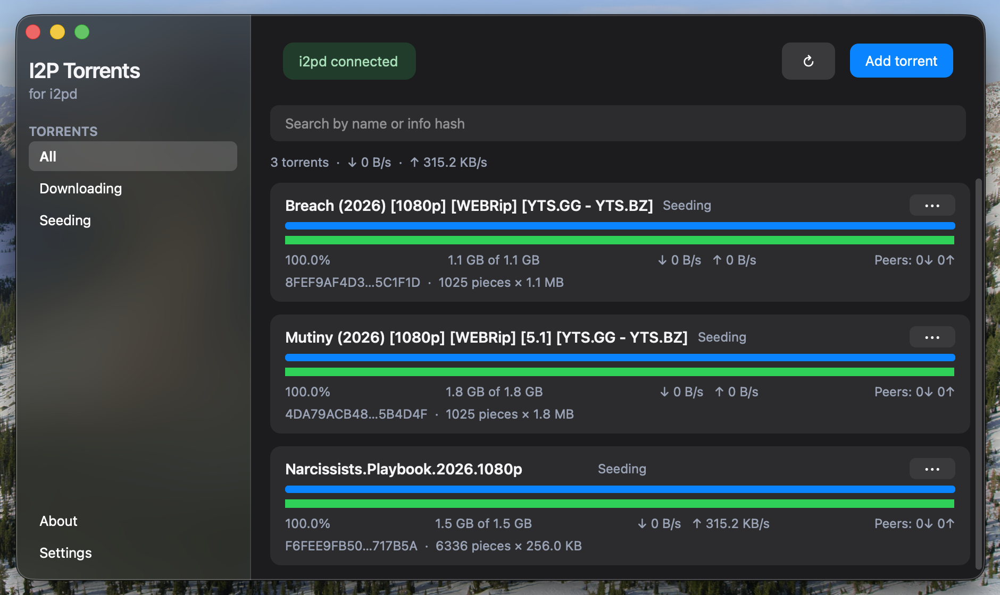
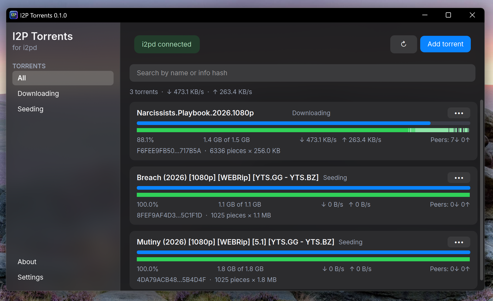
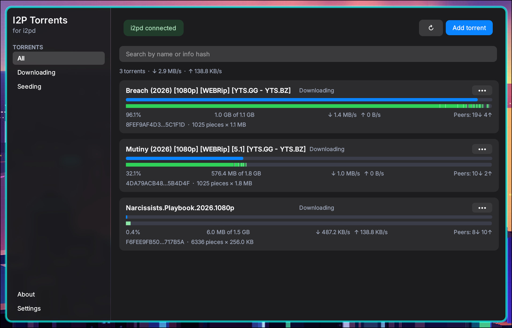

<p align="center">
  
</p>

<h1 align="center">I2P Torrents</h1>

<p align="center">
  Cross-platform desktop GUI for the built-in <a href="https://i2pd.website">i2pd</a> torrent client<br>
  <a href="#english">English</a> · <a href="#русский">Русский</a>
</p>

<p align="center">
  
  <br>
  <em>macOS</em>
</p>

<p align="center">
  
  <br>
  <em>Windows</em>
</p>

<p align="center">
  
  <br>
  <em>Linux</em>
</p>

---

## English

A desktop client for i2pd’s torrent tunnel, built with **C++17** and **Qt 6 Widgets**. The UI follows the look of [I2PChat-ng](https://github.com/MetanoicArmor/I2PChat-ng): light and night themes, cards, a compact sidebar, and native behaviour on Linux, Windows, and macOS.

### Requirements

- **i2pd** with torrent RPC (openssl branch / build newer than 2.61.0; Boost ≥ 1.81)
- **Qt 6** (Widgets + Network)
- **CMake** ≥ 3.16 and a C++17 toolchain (MSVC, Clang, or GCC)

### Install i2pd + torrents tunnel

1. Install [i2pd](https://i2pd.website) for your OS.
2. Add a torrents section to `tunnels.conf`:

```ini
[MyTorrents]
type=torrents
trackers=http://tracker2.postman.i2p/announce.php
torrentsdir=/path/to/torrents
rpcport=9191
rpcpath=mytorrents
```

Do not change the tracker. Create `torrentsdir` and ensure the i2pd process can write to it.

**Where `tunnels.conf` usually lives**

| OS | Paths (first existing with `type=torrents` wins) |
| --- | --- |
| Windows | `%APPDATA%\i2pd\tunnels.conf`, `%LOCALAPPDATA%\i2pd\tunnels.conf` |
| macOS | `~/Library/Application Support/i2pd/tunnels.conf`, `~/.i2pd/tunnels.conf` |
| Linux | `/var/lib/i2pd/tunnels.conf`, `~/.i2pd/tunnels.conf`, `/etc/i2pd/tunnels.conf`, `/etc/i2pd/tunnels.d/*.conf` |

3. Restart i2pd.
4. Check RPC:

```bash
curl -sS -X POST http://127.0.0.1:9191/mytorrents/rpc/ \
  -H 'Content-Type: application/json' \
  -d '{"method":"torrent-get","arguments":{"fields":["id","name"]},"tag":1}'
```

The GUI turns `http://127.0.0.1:9191/mytorrents` into `/mytorrents/rpc/`.
i2pd RPC has no authentication or TLS, so the GUI only allows loopback (`localhost`, `127.0.0.0/8`, `::1`).

#### Linux notes (system i2pd)

On most distros the **system** `i2pd` service runs as user `i2pd`. Prefer `torrentsdir=/home/i2pd/torrents` (not a path under your login home).

```bash
sudo mkdir -p /home/i2pd/torrents
sudo chown -R i2pd:i2pd /home/i2pd
```

If the unit sets `ProtectHome=true`, add a drop-in so the service can see that directory:

```bash
sudo mkdir -p /etc/systemd/system/i2pd.service.d
sudo tee /etc/systemd/system/i2pd.service.d/torrents.conf <<'EOF'
[Service]
ProtectHome=no
EOF
sudo systemctl daemon-reload
sudo systemctl restart i2pd
ss -tln | grep 9191
```

For offline fallback (RPC down), give your user write access, for example:

```bash
sudo usermod -aG i2pd "$USER"
sudo chmod 775 /home/i2pd/torrents
# log out and back in
```

If port `9191` stays closed, check `/var/lib/i2pd/i2pd.log` for `Permission denied` / `Can't create torrents RPC server`.

### Install I2P Torrents GUI

Active code is in `cpp/`, `native/`, and `tests/`. The legacy `src/` Rust tree is not built by CMake.

#### Windows

Needs Visual Studio C++ Build Tools (MSVC) and Qt 6.

```powershell
# once per machine — installs Qt 6.8.3 MSVC kit if missing (Python 3 + network)
.\scripts\setup-windows-dev.ps1 -InstallQt

# or point at an existing kit:
# .\scripts\setup-windows-dev.ps1 -QtDir 'C:\Qt\6.8.3\msvc2022_64'

cmake -B build -DCMAKE_BUILD_TYPE=Release
cmake --build build --config Release
.\build\bin\Release\I2PTorrents.exe
```

Release package:

```powershell
.\build-windows.ps1
```

Result: `dist\I2PTorrents\I2PTorrents.exe` and `I2PTorrents-windows-<arch>-v<version>.zip`.

#### Linux

```bash
# Debian/Ubuntu
sudo apt install qt6-base-dev qt6-tools-dev cmake g++

cmake -B build -DCMAKE_BUILD_TYPE=Release
cmake --build build
ctest --test-dir build --output-on-failure
# headless: QT_QPA_PLATFORM=offscreen ctest --test-dir build --output-on-failure
./build/bin/I2PTorrents
```

Release / AppImage:

```bash
./build-linux.sh
```

Result: `dist/I2PTorrents/`, zip, AppImage, `.deb`, and `.rpm` when `dpkg-deb` / `rpmbuild` are available.

#### macOS

```bash
brew install qt@6 cmake
cmake -B build -DCMAKE_BUILD_TYPE=Release -DCMAKE_PREFIX_PATH="$(brew --prefix qt@6)"
cmake --build build
ctest --test-dir build --output-on-failure
./build/bin/I2PTorrents
```

Release `.app`:

```bash
./build-macos.sh
```

Result: `dist/I2PTorrents.app` and `I2PTorrents-macOS-<arch>-v<version>.zip` (needs `macdeployqt` from Qt).

Version comes from the `VERSION` file.

### GitHub Releases (CI)

Tagged releases (`v*`, e.g. `v0.2.1`) and manual **Release** workflow runs build packages on GitHub Actions (no Docker):

| Platform | Artifacts |
| --- | --- |
| Windows x64 / ARM64 | `.zip` (windeployqt bundle) |
| Linux x86_64 / aarch64 | `.zip`, `.AppImage`, `.deb`, `.rpm` |
| macOS Intel / Apple Silicon | `.zip` (`.app` via macdeployqt) |

Push a version tag matching `VERSION`, or run **Actions → Release → Run workflow**. Assets are attached to the GitHub Release on tag pushes.

### First run

1. Start i2pd with a working `[MyTorrents]` section.
2. Open **Settings**:
   - **RPC address** — read-only from `rpcport` / `rpcpath` in `tunnels.conf`. Change those keys and restart i2pd.
   - **Torrents folder** — read-only from `torrentsdir`. **Browse** opens the folder in the OS file manager; change the path only in i2pd’s config, then restart i2pd.
3. Offline fallback (RPC unavailable): the GUI may copy a `.torrent` into the saved folder path — that still needs write permission on `torrentsdir`.
4. **Create torrent** builds a BitTorrent v1 `.torrent` locally (SHA-1 pieces, like `transmission-create`). Default announce comes from `trackers=` in `tunnels.conf`. Optionally add the new file to i2pd via RPC. For seeding, keep the data under `torrentsdir` with matching paths.

### Features

- torrent list, progress, piece map, rates, peers, and info hash;
- file list on torrent click (available before the download finishes);
- simple card view in settings;
- copy info hash and open the download folder;
- add `.torrent` files; **create** `.torrent` from a file or folder; remove with or without data;
- search, filters, language (English / Русский), theme;
- automatic refresh and connection diagnostics.

### i2pd RPC limits

Current i2pd exposes `torrent-add`, `torrent-get`, and `torrent-remove`. On the openssl branch, `torrent-get` returns `files`, `wanted`, `priorities`, `percentDone`, `eta`, `trackers`, and peer `clientName`/`progress` (BEP10). `wanted`/`priorities` are still stubs, and `torrent-set` is not implemented yet. Pause, resume, tracker edits, speed limits, and magnet links are not available. Create torrent in the GUI, or add a ready `.torrent` file.

### License

[BSD 3-Clause](LICENSE). Author: [Vade](AUTHORS).

---

## Русский

Кроссплатформенный настольный клиент для встроенного torrent-клиента i2pd на **C++17** и **Qt 6 Widgets**. Интерфейс в стиле [I2PChat-ng](https://github.com/MetanoicArmor/I2PChat-ng): светлая и ночная темы, карточки, компактная боковая панель.

### Требования

- **i2pd** с torrent RPC (ветка openssl / сборка новее 2.61.0; Boost ≥ 1.81)
- **Qt 6** (Widgets + Network)
- **CMake** ≥ 3.16 и toolchain C++17 (MSVC, Clang или GCC)

### Установка i2pd и torrents-туннеля

1. Установите [i2pd](https://i2pd.website).
2. Добавьте секцию в `tunnels.conf`:

```ini
[MyTorrents]
type=torrents
trackers=http://tracker2.postman.i2p/announce.php
torrentsdir=/path/to/torrents
rpcport=9191
rpcpath=mytorrents
```

Трекер менять не следует. Создайте `torrentsdir` и дайте процессу i2pd право записи.

**Где обычно лежит `tunnels.conf`**

| ОС | Пути (берётся первый существующий с `type=torrents`) |
| --- | --- |
| Windows | `%APPDATA%\i2pd\tunnels.conf`, `%LOCALAPPDATA%\i2pd\tunnels.conf` |
| macOS | `~/Library/Application Support/i2pd/tunnels.conf`, `~/.i2pd/tunnels.conf` |
| Linux | `/var/lib/i2pd/tunnels.conf`, `~/.i2pd/tunnels.conf`, `/etc/i2pd/tunnels.conf`, `/etc/i2pd/tunnels.d/*.conf` |

3. Перезапустите i2pd.
4. Проверьте RPC:

```bash
curl -sS -X POST http://127.0.0.1:9191/mytorrents/rpc/ \
  -H 'Content-Type: application/json' \
  -d '{"method":"torrent-get","arguments":{"fields":["id","name"]},"tag":1}'
```

GUI превращает `http://127.0.0.1:9191/mytorrents` в `/mytorrents/rpc/`.
Без авторизации и TLS разрешён только loopback.

#### Заметки для Linux (системный i2pd)

Сервис обычно работает от пользователя `i2pd`. Предпочтительно `torrentsdir=/home/i2pd/torrents`.

```bash
sudo mkdir -p /home/i2pd/torrents
sudo chown -R i2pd:i2pd /home/i2pd
```

При `ProtectHome=true` добавьте drop-in:

```bash
sudo mkdir -p /etc/systemd/system/i2pd.service.d
sudo tee /etc/systemd/system/i2pd.service.d/torrents.conf <<'EOF'
[Service]
ProtectHome=no
EOF
sudo systemctl daemon-reload
sudo systemctl restart i2pd
ss -tln | grep 9191
```

Для offline-fallback (RPC недоступен):

```bash
sudo usermod -aG i2pd "$USER"
sudo chmod 775 /home/i2pd/torrents
# перелогиньтесь
```

Если `9191` закрыт — смотрите `/var/lib/i2pd/i2pd.log`.

### Установка I2P Torrents GUI

Активный код — в `cpp/`, `native/`, `tests/`. Дерево Rust в `src/` CMake не собирает.

#### Windows

Нужны Visual Studio C++ Build Tools (MSVC) и Qt 6.

```powershell
.\scripts\setup-windows-dev.ps1 -InstallQt
# или: .\scripts\setup-windows-dev.ps1 -QtDir 'C:\Qt\6.8.3\msvc2022_64'

cmake -B build -DCMAKE_BUILD_TYPE=Release
cmake --build build --config Release
.\build\bin\Release\I2PTorrents.exe
```

Релиз:

```powershell
.\build-windows.ps1
```

Результат: `dist\I2PTorrents\I2PTorrents.exe` и zip.

#### Linux

```bash
sudo apt install qt6-base-dev qt6-tools-dev cmake g++

cmake -B build -DCMAKE_BUILD_TYPE=Release
cmake --build build
ctest --test-dir build --output-on-failure
./build/bin/I2PTorrents
```

Релиз / AppImage:

```bash
./build-linux.sh
```

#### macOS

```bash
brew install qt@6 cmake
cmake -B build -DCMAKE_BUILD_TYPE=Release -DCMAKE_PREFIX_PATH="$(brew --prefix qt@6)"
cmake --build build
ctest --test-dir build --output-on-failure
./build/bin/I2PTorrents
```

Релиз `.app`:

```bash
./build-macos.sh
```

Версия берётся из файла `VERSION`.

### Релизы на GitHub (CI)

По тегу `v*` (например `v0.2.1`) и вручную через workflow **Release** собираются пакеты в GitHub Actions (без Docker):

| Платформа | Артефакты |
| --- | --- |
| Windows x64 / ARM64 | `.zip` |
| Linux x86_64 / aarch64 | `.zip`, `.AppImage`, `.deb`, `.rpm` |
| macOS Intel / Apple Silicon | `.zip` (`.app`) |

Создайте тег по версии из `VERSION` или запустите **Actions → Release → Run workflow**. На push тега файлы попадают в GitHub Release.

### Первый запуск

1. Запустите i2pd с рабочей секцией `[MyTorrents]`.
2. Откройте **Настройки**:
   - **Адрес RPC** — только чтение из `rpcport` / `rpcpath` в `tunnels.conf`. Меняйте эти ключи и перезапускайте i2pd.
   - **Каталог торрентов** — только чтение из `torrentsdir`. **Обзор** открывает папку в проводнике ОС; путь меняйте только в конфиге i2pd и перезапускайте демон.
3. Offline-fallback: при недоступном RPC GUI может копировать `.torrent` в сохранённый путь — нужны права записи на `torrentsdir`.
4. **Создать торрент** собирает BitTorrent v1 `.torrent` локально (SHA-1 кусков, как `transmission-create`). Announce по умолчанию из `trackers=` в `tunnels.conf`. Можно сразу добавить файл в i2pd через RPC. Для раздачи данные должны быть в `torrentsdir` с теми же путями.

### Возможности

- список торрентов, прогресс, карта кусков, скорости, пиры и info hash;
- список файлов по клику на карточку;
- упрощённый вид карточек в настройках;
- копирование info hash и открытие папки загрузки;
- добавление `.torrent`; **создание** `.torrent` из файла или папки; удаление с данными или без;
- поиск, фильтры, язык, тема;
- автообновление и диагностика соединения.

### Ограничения i2pd RPC

Доступны `torrent-add`, `torrent-get`, `torrent-remove`. В ветке openssl — `files`, `wanted`, `priorities`, `percentDone`, `eta`, `trackers`, у пиров `clientName`/`progress`. `torrent-set`, пауза, resume, правка трекеров, лимиты и magnet пока недоступны. Создавайте торрент в GUI или добавляйте готовый `.torrent`.

### Лицензия

[BSD 3-Clause](LICENSE). Автор: [Vade](AUTHORS).

---

## Support

<div align="center">


```
bc1qfenneg8pt7g42f94uww3l3d7gtw6rl9dd3uslg
```

Minimum transaction: **0.0001 BTC** (smaller amounts will not arrive).  
Минимальная сумма: **0.0001 BTC** (иначе средства не дойдут).

Thank you / Спасибо 🙏

</div>
