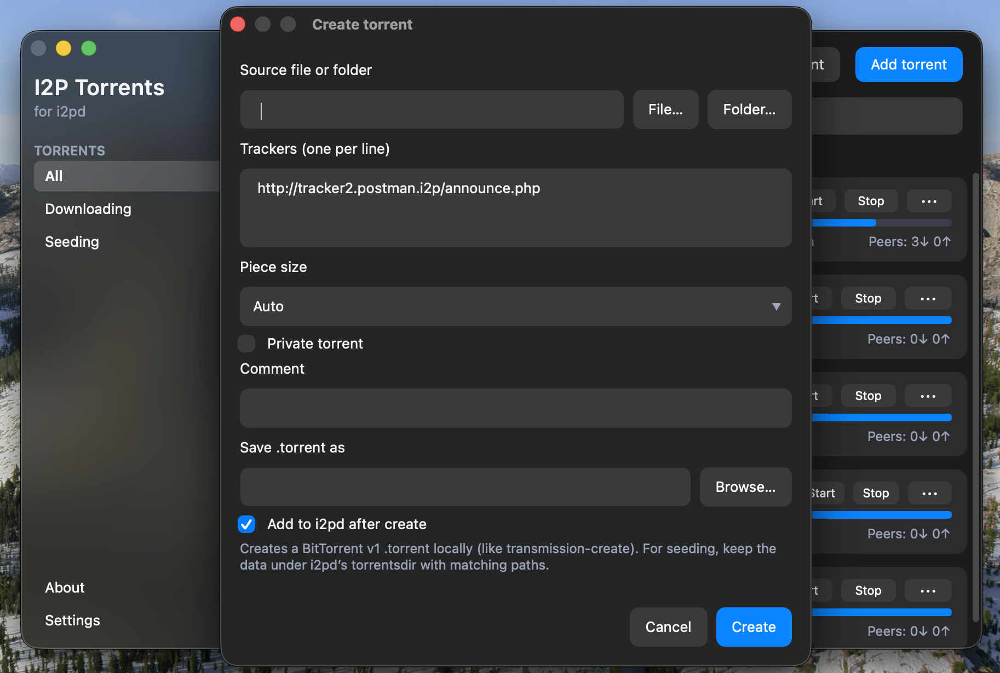
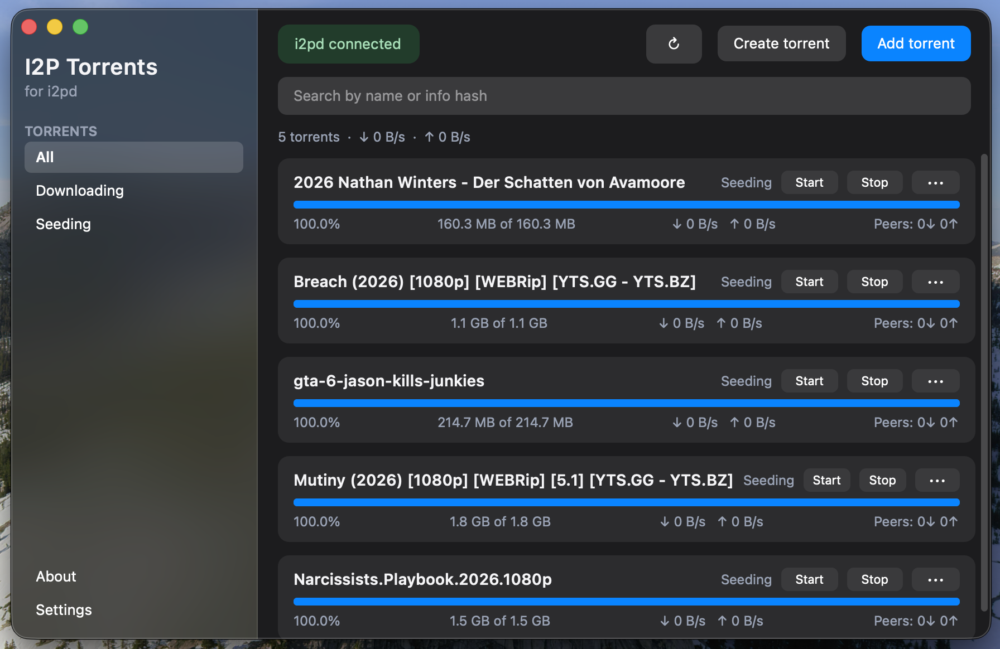

<p align="center">
  
</p>

<h1 align="center">I2P Torrents</h1>

<p align="center">
  Cross-platform desktop GUI for the built-in <a href="https://i2pd.website">i2pd</a> torrent client<br>
  <a href="#english">English</a> · <a href="#русский">Русский</a>
</p>

<p align="center">
  <br>
  
</p>

---

## English

A desktop client for i2pd’s torrent tunnel. The UI follows the look of [I2PChat-ng](https://github.com/MetanoicArmor/I2PChat-ng): light and night themes, cards, a compact sidebar, and native behaviour on Linux, Windows, and macOS.

### Features

- torrent list, progress, piece map, rates, peers, and info hash;
- file list on torrent click (available before the download finishes), with skip/priority via `torrent-set` when the daemon supports it;
- simple card view in settings (no piece bar or hash);
- copy info hash and open the download folder;
- add `.torrent` files;
- remove a torrent alone or together with downloaded data;
- search, filters, UI language (English / Русский), and theme in settings;
- automatic refresh and connection diagnostics;
- fallback without RPC: copy the `.torrent` into `torrentsdir`;
- persist RPC address, folder, and theme.

### i2pd setup

Add to `tunnels.conf`:

```ini
[MyTorrents]
type=torrents
trackers=http://tracker2.postman.i2p/announce.php
torrentsdir=/home/i2pd/torrents
rpcport=9191
rpcpath=mytorrents
```

Do not change the tracker. RPC needs an i2pd build with Boost 1.81 or newer. In the GUI use the usual address:

```text
http://127.0.0.1:9191/mytorrents
```

The app turns that into the real endpoint `/mytorrents/rpc/`.
i2pd RPC has no authentication or TLS, so the GUI only allows loopback
(`localhost`, `127.0.0.0/8`, `::1`).

### Run from source

The GUI is a **Rust + Qt Widgets** desktop app (same QSS themes). It talks to i2pd over Transmission RPC.

```bash
# Qt 6 development packages, then:
#   macOS: brew install qt@6 rust
#   Debian/Ubuntu: sudo apt install qt6-base-dev qt6-tools-dev
cargo test --no-default-features
# macOS Homebrew needs C++17 and framework headers:
./scripts/cargo-qt.sh run --features gui
# same as:
#   export CXXFLAGS="-std=c++17 -include arm_acle.h $(pkg-config --cflags Qt6Widgets Qt6Gui Qt6Core Qt6UiTools)"
#   cargo run --features gui
```

### Build

The icon source is `image.png`. The scripts produce `icon.png`, a Windows `.ico` when ImageMagick is available, and (on macOS) `.icns`, then pack a release binary.

From the repo root:

```bash
./build-macos.sh      # macOS
./build-linux.sh      # Linux
```

**macOS**

```bash
./build-macos.sh
```

Result: `dist/I2PTorrents.app` and `I2PTorrents-macOS-<arch>-v<version>.zip`. Requires `macdeployqt` (`brew install qt@6`).

**Linux**

```bash
./build-linux.sh
```

Result: `dist/I2PTorrents/` (launcher + bundled Qt libs), `I2PTorrents-linux-<arch>-v<version>.zip`, and an AppImage in `dist/` when `appimagetool` is available.

**Windows** (PowerShell)

```powershell
.\build-windows.ps1
```

Result: `dist\I2PTorrents\I2PTorrents.exe` and `I2PTorrents-windows-<arch>-v<version>.zip`. Requires `windeployqt` (Qt 6 `bin` on `PATH`).

Rust and Qt 6 are required. The release version comes from the `VERSION` file.

### i2pd RPC limits

Current i2pd exposes `torrent-add`, `torrent-get`, and `torrent-remove`. `torrent-get` can return `files`, `wanted`, and `priorities` (openssl branch, 20 Aug 2026). `wanted`/`priorities` are still stubs, and `torrent-set` is not implemented yet, so skip/priority in the GUI will show a notice until the daemon accepts it. Pause, resume, tracker edits, speed limits, and magnet links are not available. Add a ready `.torrent` file.

### License

[BSD 3-Clause](LICENSE). Author: [Vade](AUTHORS).

---

## Русский

Кроссплатформенный настольный клиент для встроенного torrent-клиента i2pd. Интерфейс выполнен в визуальном стиле [I2PChat-ng](https://github.com/MetanoicArmor/I2PChat-ng): светлая и ночная темы, карточки, компактная боковая панель и нативное поведение на Linux, Windows и macOS.

### Возможности

- список торрентов, прогресс, карта кусков, скорости, пиры и info hash;
- список файлов по клику на карточку (до полной загрузки), с попыткой задать пропуск и приоритет через `torrent-set`;
- упрощённый вид карточек в настройках (без полосы кусков и хеша);
- копирование info hash и открытие папки загрузки;
- добавление `.torrent`-файлов;
- удаление торрента отдельно или вместе с загруженными данными;
- поиск, фильтры, язык интерфейса (English / Русский) и тема в настройках;
- автоматическое обновление и диагностика соединения;
- fallback без RPC: копирование `.torrent` в `torrentsdir`;
- сохранение адреса RPC, каталога и темы.

### Настройка i2pd

Добавьте в `tunnels.conf`:

```ini
[MyTorrents]
type=torrents
trackers=http://tracker2.postman.i2p/announce.php
torrentsdir=/home/i2pd/torrents
rpcport=9191
rpcpath=mytorrents
```

Трекер менять не следует. RPC требует сборку i2pd с Boost 1.81 или новее. В GUI укажите привычный адрес:

```text
http://127.0.0.1:9191/mytorrents
```

Приложение само преобразует его в фактический endpoint `/mytorrents/rpc/`.
Поскольку RPC i2pd не поддерживает авторизацию и TLS, GUI намеренно разрешает
подключение только к loopback-адресам (`localhost`, `127.0.0.0/8`, `::1`).

### Запуск из исходников

GUI — это настольное приложение на **Rust + Qt Widgets** (те же QSS-темы). Оно ходит в i2pd по Transmission RPC.

```bash
# пакеты Qt 6, затем:
#   macOS: brew install qt@6 rust
#   Debian/Ubuntu: sudo apt install qt6-base-dev qt6-tools-dev
cargo test --no-default-features
# на macOS Homebrew нужны C++17 и заголовки framework:
./scripts/cargo-qt.sh run --features gui
# то же самое:
#   export CXXFLAGS="-std=c++17 -include arm_acle.h $(pkg-config --cflags Qt6Widgets Qt6Gui Qt6Core Qt6UiTools)"
#   cargo run --features gui
```

### Сборка

Исходник иконки — `image.png`. Скрипты собирают `icon.png`, Windows `.ico` при наличии ImageMagick и (на macOS) `.icns`, затем упаковывают release-бинарник.

Из корня репозитория:

```bash
./build-macos.sh      # macOS
./build-linux.sh      # Linux
```

**macOS**

```bash
./build-macos.sh
```

Результат: `dist/I2PTorrents.app` и `I2PTorrents-macOS-<arch>-v<version>.zip`. Нужен `macdeployqt` (`brew install qt@6`).

**Linux**

```bash
./build-linux.sh
```

Результат: `dist/I2PTorrents/` (лаунчер и Qt-библиотеки), `I2PTorrents-linux-<arch>-v<version>.zip` и при наличии `appimagetool` — AppImage в `dist/`.

**Windows** (PowerShell)

```powershell
.\build-windows.ps1
```

Результат: `dist\I2PTorrents\I2PTorrents.exe` и `I2PTorrents-windows-<arch>-v<version>.zip`. Нужен `windeployqt` (каталог `bin` Qt 6 в `PATH`).

Нужны Rust и Qt 6. Версия релиза берётся из файла `VERSION`.

### Ограничения i2pd RPC

Текущая реализация i2pd предоставляет `torrent-add`, `torrent-get` и `torrent-remove`. В `torrent-get` уже есть поля `files`, `wanted` и `priorities` (ветка openssl, 20 августа 2026). `wanted`/`priorities` пока заглушки, а `torrent-set` ещё нет — пропуск и приоритет в GUI покажут предупреждение, пока демон их не примет. Пауза, возобновление, изменение трекеров, лимитов скорости и magnet-ссылки пока не поддерживаются. Добавляйте готовый `.torrent`-файл.

### Лицензия

[BSD 3-Clause](LICENSE). Автор: [Vade](AUTHORS).

---

## Support

<div align="center">


```
UQCsX_UVKylmlxb4dWZlXdmlyRzNm-kzUx7Ld1VQHk1ob0MY
```

Thank you / Спасибо 🙏

</div>
